= PlayTime, Scriptbook, and CentrMark
:navtitle: PlayTime
:description: Three layers: markup, engine, app. Do not mix them.

Write this so someone with no background can follow.

== What do I need?

You only need this page if you are changing how playbooks run, or how they talk to the Equivalence Engine.

== The three names

Think of a cookbook, a kitchen, and the recipes on the page.

.Cookbook, kitchen, waiter

[cols="1,1,2", options="header"]
|===
| Layer | Name | Job

| Format
| **CentrMark** (`.cmk` files)
| The writing. Directives like `::: playbook` and `::: step`. CentrMark does **not** run anything.

| Engine
| **PlayTime**
| The kitchen. It reads a playbook, learns what computer you are on, asks the Equivalence Engine for the right command, runs it, and writes a sidecar. It does **not** own package catalogs. It does **not** rewrite the `.cmk`.

| App
| **Scriptbook**
| The reader. Today this is the `scriptbook` CLI. Later it is also a DevCentr screen. It opens a `.cmk`, talks to the user, and asks PlayTime to play.

|===

Keep the word **playbook** for the document (`::: playbook`). PlayTime is the moment it runs. Scriptbook is the app that starts that moment.

Do **not** split PlayTime into a new GitHub repo yet. Today PlayTime is the D library in `lib/`. The CLI in `cli/` is Scriptbook. The binary name stays `scriptbook`. It rhymes with OpenShellOrg (argv, host honesty). It stays here while it is being built.

.Aligned, not moved

== Who may call whom

* CentrMark must not call the Equivalence Engine.
* PlayTime may call `libequivalence`.
* Scriptbook may call PlayTime. It must not rank install methods itself.
* The Equivalence Engine must not parse `.cmk` files.

== What this is not

This is **not** a translator that rewrites bash into PowerShell.

.Do not put a bash script through a blender

A playbook should name an **intent** (what you want). PlayTime binds that intent to a command for *this* computer. Glue that is already portable can stay as a Nushell (or other) script cell.

See:

* link:playbook-profile.adoc[Playbook profile] — directives
* link:host-awareness.adoc[Host Awareness] — how PlayTime learns the OS
* link:sidecar.adoc[Sidecar schema] — run records
